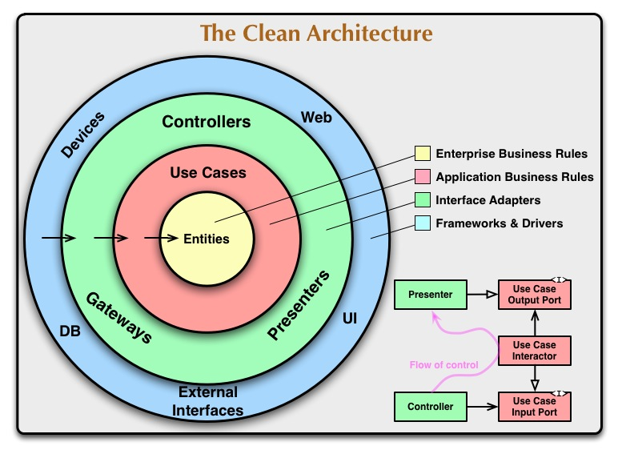

## Table of Contents

- [Summary](#nestjs-architecture)
- [Layers](#layers)
- [Microservices Interaction](#microservices-interaction)

## NestJS Architecture

This repository demonstrates a simple microservice that supports CRUD operations<br>
on a books repository, following the principles of Clean Architecture.<br>
The architecture is designed with NestJS and TypeScript to provide a good separation of<br>
concerns and make the application flexible to changes.
Remember that the project follows Clean Architecture principles,<br>
which means that each layer has its own responsibility and they are loosely coupled.<br>
This makes the project more flexible and easier to maintain or extend in the future.

## Layers

The architecture is divided into several layers:

- **Entities**: The business entities of the application, such as books.<br>
These entities are independent from external changes like services, routing or controllers.

- **Use Cases**: This layer is where the business logic of the application is centralized.<br>
Each use case orchestrates all of the logic for a specific business use case.

- **Data Service Abstraction**: This layer exposes repositories for each entity<br>
and supports basic CRUD operations.

- **Presenter**: The presenter gets data from the application repository and builds a formatted response for the client.<br>
It is implemented together with the controller in this architecture.

- **Frameworks**: This layer includes all specific implementations, such as the database, monitoring, billing, error handling, etc.<br>
The main framework used in this project is Nest.js, which is built upon Express.js.

<p align="center">
  <a target="blank"></a>
</p>

## Microservices Interaction

To interact with other microservices, you can use HTTP client libraries such as `Axios` or use the built-in `HttpService` provided by Nest.js.<br>
Here's a simple example of how to make a GET request to another microservice:

```
import { HttpService } from '@nestjs/axios';
import { Injectable } from '@nestjs/common';
import { map } from 'rxjs/operators';

@Injectable()
export class BooksService {
  constructor(private httpService: HttpService) {}

  getBook(id: string) {
    return this.httpService
      .get(`http://another-microservice-url.com/books/${id}`)
      .pipe(map(response => response.data));
  }
}
```
<br>
Here's a another example of how to use `RabbitMQ` for inter-service communication:

```
import { Client, ClientProxy, Transport } from '@nestjs/microservices';
import { Injectable } from '@nestjs/common';

@Injectable()
export class BooksService {
  @Client({
    transport: Transport.RMQ,
    options: {
        urls: ['amqp://localhost:5672'],
        queue: 'books_queue',
        queueOptions: { durable: false }
    }
  })
  client: ClientProxy;

  async getBook(id: string) {
    const pattern = { cmd: 'get' };
    const data = { id };
    return this.client.send(pattern, data).toPromise();
  }
}
```

This `getBook` method sends a message to the `books_queue` with a pattern of `{ cmd: 'get' }` and data of `{ id }`.<br>
The `send` method returns an Observable, so you need to convert it to a Promise with `toPromise() ` if you want to use `async/await`.

On the receiving side, you can create a controller that listens to messages from the RabbitMQ queue:

```
import { Controller } from '@nestjs/common';
import { MessagePattern, Payload, Ctx, RmqContext } from '@nestjs/microservices';

@Controller()
export class BooksController {
  @MessagePattern({ cmd: 'get' })
  getBook(@Payload() data: any, @Ctx() context: RmqContext) {
    const channel = context.getChannelRef();
    const originalMsg = context.getMessage();
    channel.ack(originalMsg);

    // Handle the request and return a response
    return { id: data.id, title: 'A book title', author: 'An author' };
  }
}
```

This `getBook` method listens to messages with a pattern of `{ cmd: 'get' }`.<br>
The `@Payload()` decorator is used to extract the data from the message,<br>
and the `@Ctx()` decorator is used to get the context of the message.<br>
Finally, `channel.ack(originalMsg);` is called to acknowledge the message

**Note**:<br>
The examples provided for microservices interaction<br>
using HTTP and RabbitMQ are not directly based on this project.<br>
They are general examples of how you can interact with other microservices<br>
in a NestJS application using HTTP requests and RabbitMQ messaging.<br>

These examples may not be directly applicable to the specific architecture<br>
or setup of this project. They are intended to serve as a starting point or guide,<br>
and you may need to modify or adapt them to fit the specifics of your project.